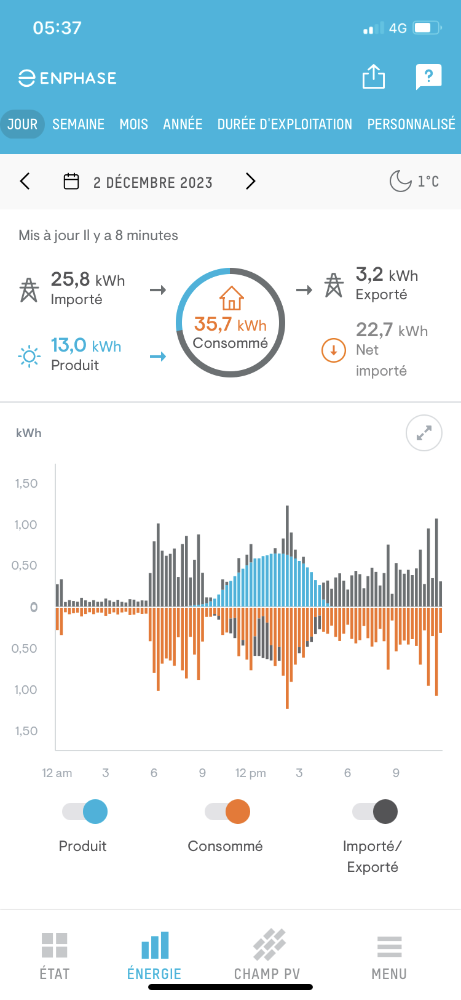

# ASI - Ne rien faire, c’est parfois mieux: 

Rapport sur le Défi ASI de La Nuit de l'Informatique
Salut à toute l'équipe du défi ASI !
Merci avant tout pour la proposition de ce défi lié aux problématiques du climat auxquelles nous sommes très sensibles à Polytech, nous avons directement choisi les défis liés à ces problématiques.

Code source : https://github.com/ndi-tty/nuit-info
Lien du site: ndi.moreiradj.net

## Frontend

### Architecture

Pour garantir une expérience utilisateur fluide tout en réduisant notre impact écologique, nous avons adopté une **architecture SPA** (Single Page Application) en **React**. Cela permet non seulement de **minimiser les requêtes serveur**, mais aussi de consommer moins de ressources système. Une Single Page Application (SPA) charge **une seule page initiale** dans le navigateur et met à jour dynamiquement son contenu à l'aide de JavaScript en manipulant de manière "reactive" les éléments du DOM. Ceci offre une expérience utilisateur fluide sans nécessiter le rechargement complet de la page. Cette page de plus est gardée dans le navigateur du client. Cela permet des interactions rapides et des transitions sans coupures. De plus, lorsque nous avons besoin d’un accès au serveur, nous ne lui demandons **que les données dont nous avons besoin**, et ce, dans **un format plus réduit que le HTML (JSON)**. À l’inverse des applications faites avec PHP, **nous n'avons pas à recharger la page entière** pour mettre à jour une toute petite partie de celle-ci. Nous réduisons donc la consommation de bande passante.

### Libraires

**Chaque téléchargement est couteux en bande passante**, particulièrement dans le monde de JavaScript. Il est ainsi important de bien choisir sa librairie. Nous avons choisi d’utiliser **React**, il est **beaucoup plus petit** que d’autres contreparties comme VueJS (**312 kb pour react contre 20 mb pour vue**). Ceci réduira la quantité de **code que les développeurs et client téléchargeront**. Dans le même registre, nous n’avons **pas utilisé de librairies, de composants ou de librairies CSS**. Tout a été fait par nos propres mains.

### Minification

En minimisant la taille des fichiers, nous **réduisons la quantité de données** qui doit être transférée à chaque consultation d'une page web. Cela se traduit par une diminution de la consommation d'énergie nécessaire pour le transfert de données à travers les réseaux, notamment les centres de données qui hébergent ces applications. Moins de données à transférer signifie moins de serveurs sollicités et, par conséquent, une empreinte carbone réduite.

En adoptant des pratiques de développement axées sur l'efficacité et l'optimisation des ressources, nous contribuons ainsi à minimiser l'impact environnemental de nos projets web. La minification, en tant qu'approche écoresponsable, s'inscrit dans une démarche globale visant à rendre le développement logiciel plus durable et respectueux de l'environnement. En réduisant la taille des fichiers, nous participons à la création d'une expérience utilisateur plus fluide tout en limitant notre empreinte carbone numérique.

### Eco-Mode

Dans notre démarche environnementale, nous avons mis en place un **"éco-mode"** au sein de notre application, qui va au-delà de la simple minification des fichiers. Ce mode éco est conçu spécifiquement pour **réduire la demande sur les ressources du backend et minimiser les opérations coûteuses en énergie**.
L'une des principales caractéristiques de ce mode éco est la réduction du nombre de requêtes vers le backend. Chaque requête génère une charge de travail (minimale grace à notre hébergement sur OrangePi), entraînant une consommation d'énergie. En limitant les requêtes au strict nécessaire, nous optimisons l'utilisation des ressources serveur, contribuant ainsi à une réduction significative de notre empreinte carbone numérique. L'éco mode permet aussi la suppression de l'animation en 3D, bien que esthétiquement attrayante, celle-ci consomme des ressources graphiques et demande le téléchargement d'un asset 3D. Nous avons tout fait pour réduire un maximum le nombre de vertex sur nos scene en utilisant notamment des assets "low poly" pour éviter du temps de calcul inutile.

## Backend

Nous nous sommes longuement demandés s'il était pertinent d'avoir un backend pour notre application. Le fait étant que l'application en soi ne nécessite absolument pas de backend. Nous avons quand bien même fait le choix d'en écrire un afin de démontrer que même dans le cas d'architecture plus complexe, il est possible de limiter son émission en carbone.

### Architecture

Notre backend est une **API Rest**, nous n’avons implémenté **que les routes HTTP nécessaires** pour garder notre code simple, et ne pas ajouter de nouvelles ressources dans la mémoire du serveur. Sur ce même plan, **l’application est stateless**, elle garde le **moins d’informations possible en mémoire** pour faire la **meilleure utilisation des resources qui lui sont attribuées**.

De plus, c’est une application suivant le **modèle réactif**, **non bloquant**, ainsi, contrairement à la programmation synchrone (bloquante), nous faisons meilleure utilisation des ressources machine. Par exemple, une requête http, ou une requête vers la base de données **ne bloquera pas un thread**. Celui-ci pourra être réutilisé par une autre requête en attendant que cette dernière se termine. Pour plus d’information : https://tokio.rs/

### Langage Rust

Notre choix du langage Rust pour le backend s'inscrit dans notre volonté de concilier hautes performances et respect de l'environnement. Rust offre une exécution rapide, à faible coût mémoire, tout en minimisant les vulnérabilités.

[language comparaison](https://raw.githubusercontent.com/ndi-tty/nuit-info/main/docs/assets/mem.png)

Nous voyons que seul C arrive à faire mieux que Rust, mais cela au prix d'une complexité accrue et d'une plus grande vulnérabilité. De plus le compilateur de rust est plus performant et plus restrictif que celui de C, ce qui permet de réduire le nombre de bugs ou de comportements inattendus. Ainsi, le développeur passe moins de temps à débugger son code, et donc moins de temps à utiliser les ressources de la machine.

Source: https://thenewstack.io/which-programming-languages-use-the-least-electricity/

### Base de données SQLite

L'utilisation de SQLite contribue à une empreinte carbone réduite grâce à sa légèreté. Cette dernière rentre en contraste avec des systèmes de gestion de base de données comme MySQL ou PostgreSQL qui embarquent beaucoup de complexité et de fonctionnalités dont nous n’avons pas forcément besoin. Évidemment, une base de données SQLite ne pourra pas passer à l’échelle. Cependant, grâce à la portabilité du langage SQL, une migration vers un autre SGBD sera presque transparent.

## Déploiement

Certains feront le choix du cloud pour héberger leur application. On pourrait penser que le cloud est une solution écologique. En effet, bien que les resource soient mutualisées, leur abondance et leur facilité d'accès incitent à la surconsommation. De plus, les datacenters sont très énergivores, consomment beaucoup d'énergie et nécessitent une climatisation permanente. De plus, comme les cloud providers poussent au maximum leur hardware, ils doivent souvent remplacer leur serveurs, ce qui génère beaucoup de déchets. C'est pourquoi nous avons fait le choix d'héberger notre application sur un Orange Pi Zero2 alimenté par des panneaux solaires.

### Hébergement sur un Orange Pi Zero2 alimenté par des panneaux solaires

Notre choix d'héberger l'application sur un Orange Pi Zero2 alimenté par des panneaux solaires met en lumière notre engagement envers les énergies renouvelables. Les Orange Pi ont une architecture de CPU ARM, calibrée pour la basse consommation et la basse génération de chaleur. De plus, on n'utilise pas plus de ressources que nécessaire, ce qui permet de réduire la consommation d'énergie. Enfin, l'utilisation de panneaux solaires pour alimenter l'Orange Pi Zero2 permet de réduire l'empreinte carbone de notre application. Nous permettant de fonctionner la plupart du temps à l'énergie solaire, nous réduisons notre dépendance aux énergies fossiles (bien qu'en France, l'energie est est déjà très décarbonée).

Sur cette image vous pouvez voir une preuve de l'utilisation de notre panneau solaire ce qui nous permet d'être neutre en carbone pendant environ 10 heures par jour.

[orange pi zero 2](./assets/orange.jpg)

Vous pouvez voir sur cette image notre orange pi zero 2, qui est un ordinateur de la taille d'une carte de crédit, qui consomme très peu d'énergie et qui est très facile à transporter. On dénottera tout de même son charme certain.

### Utilisation de Docker

Nous avons choisi de déployer notre application dans un conteneur Docker. Docker est une technologie de conteneurisation qui permet d'exécuter des applications dans des environnements isolés. En plus de faciliter le déploiement et la gestion des applications, Docker contribue à une empreinte carbone réduite en optimisant l'utilisation des ressources matérielles. En effet, grâce à docker on peut facilement déployer plusieurs applications sur le même serveur, ainsi, les organisations utilisant docker n'ont pas besoin récupérer de nouveaux serveurs. De plus, Docker permet de réduire le temps de déploiement et de mise à jour des applications, ce qui permet de réduire la consommation d'énergie nécessaire à la maintenance des applications.

## Outils de développement

### Markdown et Git

Certains font le choix d'utiliser google docs ou word pour écriture leurs rapports. Nous avons fait le choix d'utiliser Markdown pour le rédiger et Git pour le versionner et collaborer. En effet, quand on sait s'organiser les artifices de google docs et les fonctionnalités pas souvent utilisées de word ne sont pas nécessaires, et on se retrouve avec un outil qui consomme beaucoup de ressources pour pas grand chose.

Markdown permet de rédiger des documents structurés sans avoir à se soucier de la mise en forme. Markdown est un langage très simple à apprendre et à utiliser, ce qui permet de réduire le temps de rédaction des documents. De plus, Markdown est un langage de balisage léger, ce qui permet de réduire la taille des fichiers. Enfin, Markdown est un langage de balisage qui permet de rédiger des documents structurés, ce qui facilite la lecture et la compréhension des documents.

### VSCode

Nous avons fait le choix d'utiliser VSCode comme éditeur de code. VSCode est un éditeur de code léger, qui permet de réduire la consommation de ressources. Des fois, travailler sur 3 projets différents avec IntelliJ peut faire chauffer la machine, ce qui n'est pas le cas avec VSCode.

### AUCUNE IA !

Les IA génératives prennent de plus en plus de place dans le monde de la création. Cependant, ces IA sont très gourmandes en ressources. En effet, les IA génératives doivent effectuer des millions d'opérations, ce qui nécessite beaucoup de ressources. Par exemple, Chat GPT, consomme énormément d'énergie mais également d'eau, chaque conversation avec Chat GPT consomme [500 ml d'eau](https://www.businesstoday.in/technology/news/story/microsofts-water-usage-surges-by-thousands-of-gallons-after-the-launch-of-chatgpt-study-397951-2023-09-11). Dans un monde en réchauffement, ou les sécheresses sont de plus en plus fréquentes, il est important de réduire notre consommation d'eau. C'est pourquoi nous avons fait le choix de ne pas utiliser d'IA génératives dans notre application.

## Conclusion

Enjeu majeur de notre époque, le réchauffement climatique est une problématique qui nous concerne tous. En tant que développeurs, nous avons un rôle à jouer dans la réduction de notre empreinte carbone numérique. En adoptant des pratiques de développement écoresponsables, nous pouvons contribuer à la réduction de notre impact environnemental. Dans le cadre de ce projet, nous avons mis en place des pratiques de développement écoresponsables, notamment en adoptant une architecture SPA, en utilisant des librairies légères, en minimisant la taille des fichiers, en utilisant un éco-mode, en utilisant un langage à faible consommation d'énergie, en utilisant une base de données légère, en hébergeant l'application sur un Orange Pi Zero2 alimenté par des panneaux solaires, en utilisant Docker, en utilisant Markdown et Git, et en ne faisant pas appel à des IA génératives. En adoptant ces pratiques de développement écoresponsables, nous avons contribué à la réduction de notre empreinte carbone numérique.
